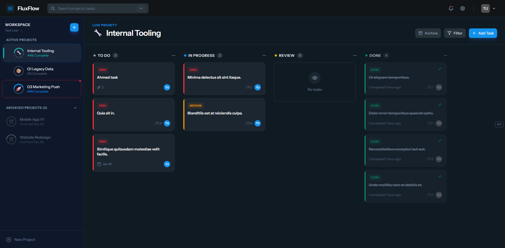
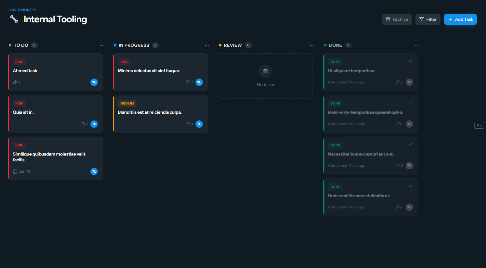
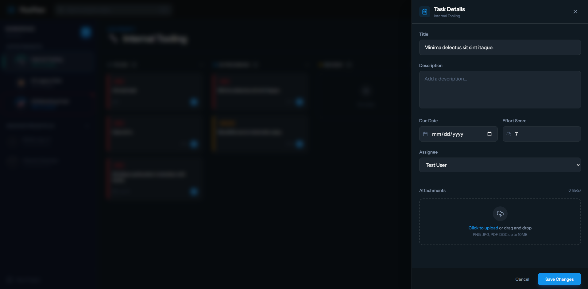
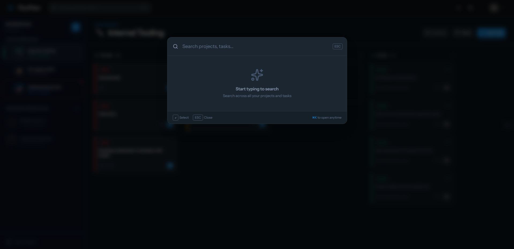

# 🌊 FluxFlow

**A Modern Project & Task Management Dashboard**

FluxFlow is a high-productivity Kanban workspace designed to bridge the gap between high-level project strategy and granular task execution. Built with the TALL Stack (Tailwind, Alpine.js, Laravel, Livewire), it emphasizes fluid motion, glassmorphic design, and power-user features.



---

## ✨ Features

### 📁 Smart Project Sidebar
- **Drag & Drop Reordering** - Prioritize projects by dragging them into your preferred order
- **Visual Identity** - Custom emoji icons and color-coded project tabs
- **Progress Rings** - Real-time completion percentage for each project
- **Priority Glow** - High-priority projects feature a subtle red glow indicator
- **The Vault** - Collapsible archive section for completed or paused projects


### 📋 Fluid Kanban Board
- **Four Status Columns** - To Do, In Progress, Review, and Done
- **Cross-Column Drag & Drop** - Move tasks between columns with smooth animations
- **Task Cards** featuring:
  - Priority badges (Low/Medium/High)
  - Due date indicators with overdue warnings
  - Effort score points
  - Assignee avatars
  - Attachment count indicators
- **Optimistic UI** - Instant visual feedback before server confirmation



### 📝 Task Details Slide-over
- **Quick Edit Panel** - Update task details without leaving the board
- **File Dropzone** - Drag & drop file uploads with progress indicators
- **Attachment Grid** - Image thumbnails and file-type icons
- **Multi-file Support** - Upload multiple files at once (max 10MB each)



### 🔍 Global Search
- **Universal Search** - Find projects and tasks across your workspace
- **Keyboard Shortcut** - Press `⌘K` or `Ctrl+K` to open instantly
- **Smart Results** - Grouped by projects and tasks with status indicators



### ⚡ Power User Features
- **Keyboard Shortcuts**
  - `N` - Create new task (when project is selected)
  - `P` - Create new project
  - `ESC` - Close any modal
  - `⌘K` / `Ctrl+K` - Open global search
- **Smooth Animations** - Weighted, tactile drag interactions
- **Dark Theme** - Easy on the eyes with glassmorphic design

---

## 🛠 Tech Stack

| Technology | Purpose |
|------------|---------|
| **Laravel 12** | Backend framework & API |
| **Livewire 3** | Real-time UI components |
| **Alpine.js** | Frontend interactivity & animations |
| **Tailwind CSS** | Utility-first styling |
| **SortableJS** | Drag & drop functionality |
| **SQLite** | Database (easily swappable to MySQL/PostgreSQL) |
| **Flux UI** | Pre-built UI components |

---

## 📦 Installation

### Prerequisites
- PHP 8.2+
- Composer
- Node.js 18+
- npm or yarn

### Setup Steps

```bash
# Clone the repository
git clone https://github.com/yourusername/fluxflow.git
cd fluxflow

# Install PHP dependencies
composer install

# Install Node dependencies
npm install

# Copy environment file
cp .env.example .env

# Generate application key
php artisan key:generate

# Run database migrations
php artisan migrate

# Seed sample data (optional)
php artisan db:seed

# Create storage symlink
php artisan storage:link

# Build assets
npm run build

# Start the development server
php artisan serve
```

### Development Mode

```bash
# Run with hot reload
npm run dev

# In a separate terminal (disable Xdebug for better performance)
XDEBUG_MODE=off php artisan serve
```

---

## 📂 Project Structure

```
fluxflow/
├── app/
│   ├── Enums/
│   │   ├── Priority.php          # Low, Medium, High
│   │   └── TaskStatus.php        # Todo, Doing, Review, Done
│   ├── Livewire/
│   │   ├── CreateProjectModal.php
│   │   ├── CreateTaskModal.php
│   │   ├── GlobalSearch.php
│   │   ├── KanbanBoard.php
│   │   ├── ProjectSidebar.php
│   │   └── TaskDetails.php
│   └── Models/
│       ├── Attachment.php        # Polymorphic file attachments
│       ├── Project.php
│       ├── Task.php
│       └── User.php
├── database/
│   ├── factories/
│   │   ├── ProjectFactory.php
│   │   ├── TaskFactory.php
│   │   └── UserFactory.php
│   └── migrations/
│       ├── create_users_table.php
│       ├── create_projects_table.php
│       ├── create_tasks_table.php
│       └── create_attachments_table.php
├── resources/
│   ├── css/
│   │   └── app.css               # Custom styles & animations
│   └── views/
│       ├── components/
│       │   └── layouts/
│       │       └── kanban.blade.php
│       └── livewire/
│           ├── create-project-modal.blade.php
│           ├── create-task-modal.blade.php
│           ├── global-search.blade.php
│           ├── kanban-board.blade.php
│           ├── project-sidebar.blade.php
│           ├── task-details.blade.php
│           └── partials/
│               ├── kanban-column.blade.php
│               └── task-card.blade.php
└── routes/
    └── web.php
```

---

## 🎨 Data Models

### Project
| Field | Type | Description |
|-------|------|-------------|
| `id` | bigint | Primary key |
| `user_id` | foreignId | Project owner |
| `title` | string | Project name |
| `icon` | string | Emoji icon (optional) |
| `color` | string | Hex color code |
| `priority` | enum | low, medium, high |
| `sort_order` | int | Display order |
| `archived_at` | timestamp | Archive date (nullable) |

### Task
| Field | Type | Description |
|-------|------|-------------|
| `id` | bigint | Primary key |
| `project_id` | foreignId | Parent project |
| `assigned_to` | foreignId | Assigned user (nullable) |
| `title` | string | Task title |
| `description` | text | Task details (nullable) |
| `priority` | enum | low, medium, high |
| `status` | enum | todo, doing, review, done |
| `sort_order` | int | Column order |
| `due_date` | date | Due date (nullable) |
| `effort_score` | tinyint | Complexity points 1-10 |

### Attachment (Polymorphic)
| Field | Type | Description |
|-------|------|-------------|
| `id` | bigint | Primary key |
| `attachable_id` | bigint | Parent ID |
| `attachable_type` | string | Parent model class |
| `file_path` | string | Storage path |
| `file_name` | string | Original filename |
| `file_size` | int | Size in bytes |

---

## ⌨️ Keyboard Shortcuts

| Shortcut | Action |
|----------|--------|
| `N` | New Task (requires selected project) |
| `P` | New Project |
| `ESC` | Close modal/slide-over |
| `⌘K` / `Ctrl+K` | Open Global Search |
| `Enter` | Submit form / Select search result |

---

## 🎯 Usage Guide

### Creating a Project
1. Click the **+** button in the sidebar, or press **P**
2. Enter project name, select icon, color, and priority
3. Click "Create Project"

### Creating a Task
1. Select a project from the sidebar
2. Click "Add Task" button or press **N**
3. Fill in task details (title, description, priority, due date)
4. Click "Create Task"

### Moving Tasks
1. Drag a task card from any column
2. Drop it into the target column
3. Tasks automatically save their new status

### Reordering Projects
1. Hover over a project in the sidebar
2. Grab the drag handle (⋮⋮ icon)
3. Drag to reorder

### Editing Task Details
1. Click on any task card
2. Update fields in the slide-over panel
3. Upload attachments via drag & drop
4. Click "Save Changes"

### Archiving Projects
1. Open a project
2. Click the "Archive" button in the header
3. Confirm the action
4. Find archived projects in the "Archived" section of the sidebar

### Searching
1. Press `⌘K` or click the search bar
2. Type your search query
3. Click a result to navigate directly

---

## 🔧 Configuration

### Environment Variables

```env
# Application
APP_NAME=FluxFlow
APP_ENV=local
APP_DEBUG=true

# Database (SQLite by default)
DB_CONNECTION=sqlite

# For MySQL, uncomment and configure:
# DB_CONNECTION=mysql
# DB_HOST=127.0.0.1
# DB_PORT=3306
# DB_DATABASE=fluxflow
# DB_USERNAME=root
# DB_PASSWORD=

# Performance
BCRYPT_ROUNDS=10
SESSION_DRIVER=file
CACHE_STORE=file
```

---

## 🚀 Performance Tips

1. **Disable Xdebug** in development:
   ```bash
   XDEBUG_MODE=off php artisan serve
   ```

2. **Use file-based cache** instead of database:
   ```env
   CACHE_STORE=file
   SESSION_DRIVER=file
   ```

3. **Enable OPcache** in production for faster PHP execution

4. **Run production build**:
   ```bash
   npm run build
   php artisan config:cache
   php artisan route:cache
   php artisan view:cache
   ```

---

## 📄 License

This project is open-sourced software licensed under the [MIT license](LICENSE).

---

## 🤝 Contributing

Contributions are welcome! Please feel free to submit a Pull Request.

1. Fork the repository
2. Create your feature branch (`git checkout -b feature/AmazingFeature`)
3. Commit your changes (`git commit -m 'Add some AmazingFeature'`)
4. Push to the branch (`git push origin feature/AmazingFeature`)
5. Open a Pull Request

---

## 📞 Support

If you have any questions or run into issues, please [open an issue](https://github.com/yourusername/fluxflow/issues) on GitHub.

---

<p align="center">
  Built with ❤️ using the TALL Stack
</p>


